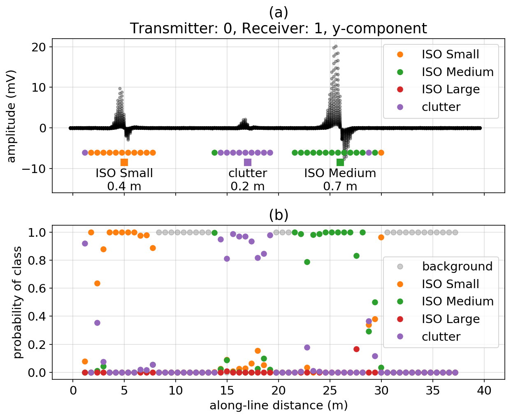

**[summary](#Summary) | [contents](#Contents) | [usage](#Usage) | [running the notebooks](#running-the-notebooks) | [issues](#issues) | [citation](#citation) | [license](#license)**

# Machine learning for classifying unexploded ordnance (UXO) from electromagnetic data

These notebooks were used to produce the figures shown in the SEG abstract [(Heagy et al., 2020)](./heagy-et-al-seg-2020.pdf). 

## Summary 

Electromagnetic methods are widely used for the detection and classification of unexploded ordnance objects in former war zones or military training grounds. Typically, targets are classified using intrinsic parameters that are estimated via inversion of the observed data. In this work, we present an approach for using convolutional neural networks to classify unexploded ordnance directly from time-domain electromagnetic data. The outputs of the network are probabilities that the signal in a given spatial window is associated with an ordnance object, as well as a classification, which is simply the class with the largest probability. We demonstrate our approach with a synthetic example and show that the trained neural network can distinguish between small, medium, and large ordnance objects, as well as metallic clutter, and background response. These results illustrate the potential utility of machine learning for the interpretation of electromagnetic data collected over sites contaminated with ordnance.



## Contents

There are 2 notebooks in this repository: 

1. [generate-data](./1-generate-data.ipynb): This notebook is used to generate synthetic data. It relies on BTInvert which is provided by [Black Tusk Geophysics](http://www.btgeophysics.com/)
2. [cnns-for-uxo](./2-cnns-for-uxo.ipynb): This notebook uses pytorch to implement a convolutional neural network to classify UXO from electromagnetic data. It runs fully on open software, with dependencies described in the [environment.yml](./environment.yml)

## Usage

To run the first notebook, you need BTInvert from [Black Tusk Geophysics](http://www.btgeophysics.com/). This produces the data files that are stored online and accessible for the machine learning pipeline. The second notebook can be run entirely on open software. 

To run the notebooks locally, you will need to have python installed,
preferably through [anaconda](https://www.anaconda.com/download/) .

You can then clone this repository. From a command line, run

```
git clone https://github.com/simpeg-research/heagy-et-al-2020-uxo-seg.git
```

Then `cd` into the `heagy-et-al-2020-uxo-seg` directory:

```
cd heagy-et-al-2020-uxo-seg
```

To setup your software environment, we recommend you use the provided conda environment

```
conda env create -f environment.yml
conda activate seg-2020-uxo
```

You can then launch Jupyter

```
jupyter notebook
```

Jupyter will then launch in your web-browser.

## Running the notebooks

Each cell of code can be run with `shift + enter` or you can run the entire notebook by selecting `cell`, `Run All` in the toolbar.


For more information on running Jupyter notebooks, see the [Jupyter Documentation](https://jupyter.readthedocs.io/en/latest/)

## Issues

Please [make an issue](https://github.com/simpeg-research/heagy-et-al-2020-uxo-seg/issues) if you encounter any problems while trying to run the notebooks.

## Citation

If you build upon or use these examples in your work, please cite:

Heagy, L. J., Oldenburg, D. W., Pérez, F. & Beran, L. (2020, submitted). Machine learning for classifying unexploded ordnance from electromagnetic data. In SEG Technical Program Expanded Abstracts 2020. Society of Exploration Geophysicists.

```
@inproceedings{Heagy2020,
author = {Heagy, Lindsey J. and Oldenburg, Douglas W and Pérez, Fernando and Beran, Laurens},
booktitle = {SEG Technical Program Expanded Abstracts 2020 (submitted)},
doi = {10.1190/segam2015-5931035.1},
publisher = {Society of Exploration Geophysicists},
title = {{Machine learning for classifying unexploded ordnance from electromagnetic data}},
year = {2020}
}
```

## License
These notebooks are licensed under the [BSD 3-Clause License](/LICENSE) which allows academic and commercial re-use and adaptation of this work.

